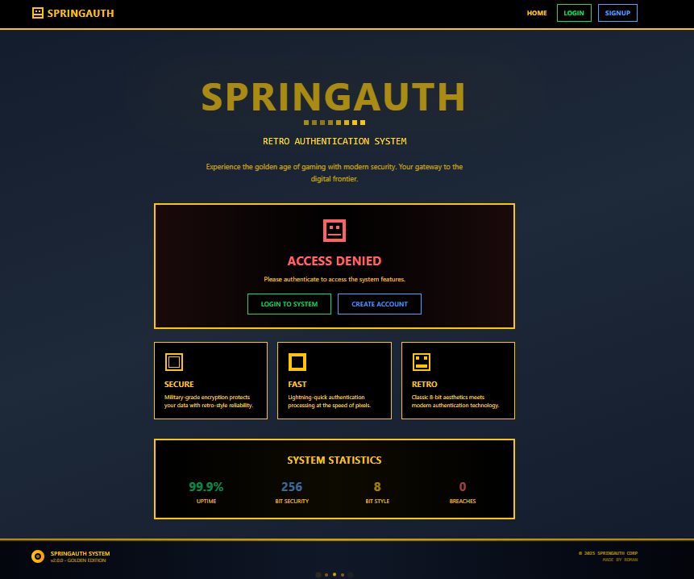
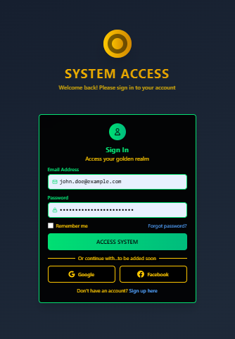
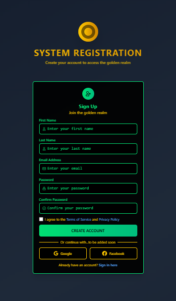
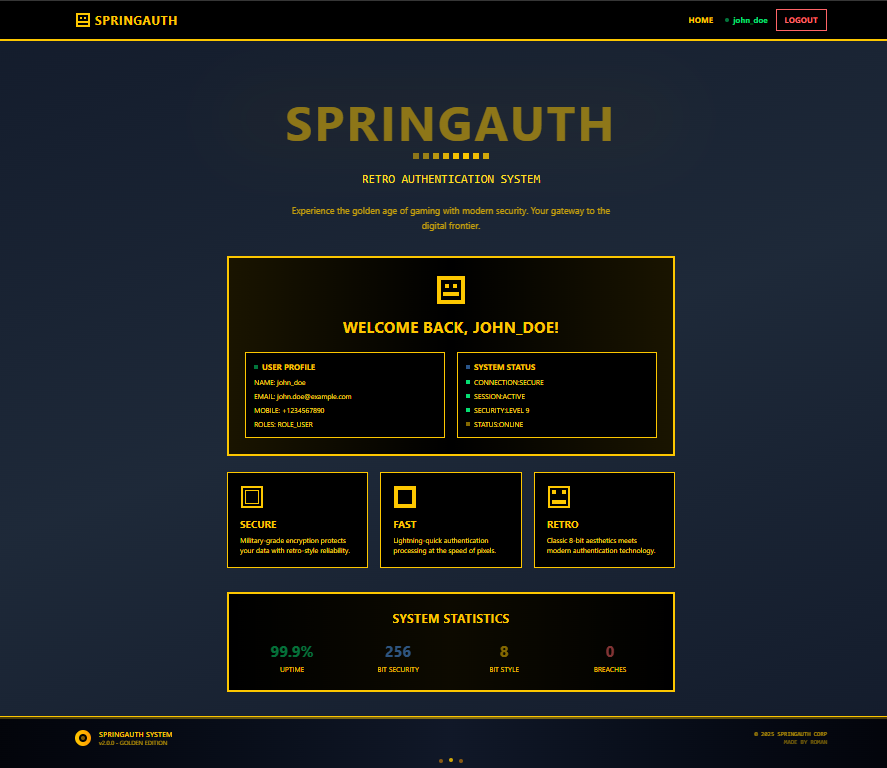
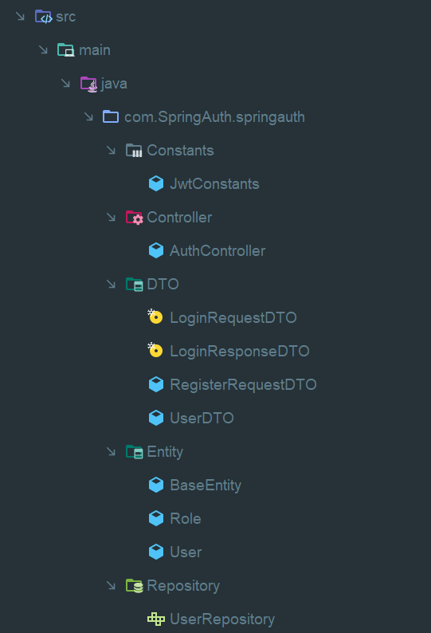
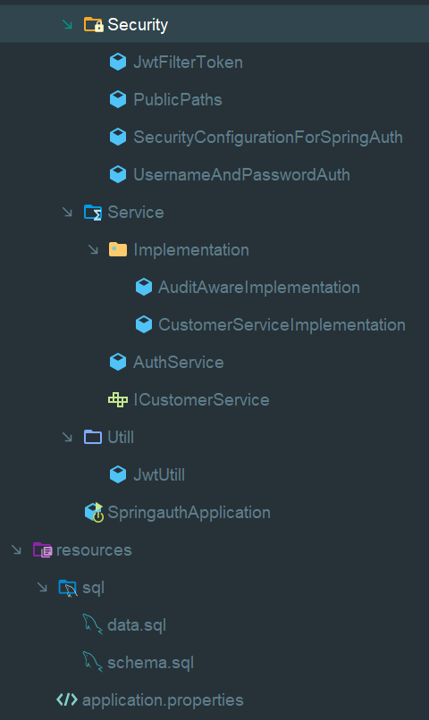

# 🔐 SpringBootAuth-JwtBased Full Stack Application

<div align="center">
  <h3>Complete Full-Stack Authentication System with Retro-Style UI</h3>
  <p>A comprehensive JWT-based authentication system with Spring Boot backend and sleek React frontend</p>
  
  
  
  
  
  
  
  
  
</div>

---

## 🚀 Features

### 🎨 **8-Bit Retro Design**
- **Golden-Black Theme**: Eye-catching retro gaming aesthetics
- **Pixel-Perfect UI**: Clean, modern components with vintage flair
- **Responsive Design**: Works seamlessly on desktop and mobile
- **Animated Elements**: Smooth transitions and hover effects

### 🔒 **Security Features**                                              
- **JWT Authentication**: Secure token-based authentication
- **Protected Routes**: Route-level access control
- **Automatic Token Management**: Seamless token refresh and storage
- **Session Persistence**: Maintains login state across browser sessions

### ⚡ **Modern Tech Stack**
- **Frontend**: React 19+ with hooks and context
- **Backend**: Spring Boot 3.0+ with Spring Security
- **Database**: MySQL 8.0+ for persistent data storage
- **Authentication**: JWT-based stateless authentication
- **ORM**: Spring Data JPA with Hibernate
- **Routing**: React Router DOM with form actions
- **HTTP Client**: Axios with interceptors for API calls
- **Styling**: TailwindCSS utility-first framework
- **Build Tool**: Vite for lightning-fast development

### 🛡️ **User Experience**
- **Toast Notifications**: Real-time feedback for user actions
- **Error Handling**: Graceful error management and user feedback
- **Loading States**: Visual feedback during API operations
- **Form Validation**: Client-side and server-side validation

---

## 📸 Screenshots

<div align="center">

### 🏠 **Home Page (Logged Out)**

*Welcome screen with authentication prompts and retro gaming aesthetics*

### 🔐 **Sign In Page**


*Clean login form with 8-bit retro styling and validation*

### 📝 **Registration Page**


*User registration form with comprehensive field validation*

### 🏠 **Home Page (Logged In)**

*Personalized dashboard showing user information and system status*

</div>

---

## 📁 Complete Project Structure

```
SpringAuthProject/
├── springauth/                     # Spring Boot Backend
│   ├── src/
│   │   ├── main/
│   │   │   ├── java/
│   │   │   │   └── com/springauth/ # Main application packages
│   │   │   └── resources/
│   │   │       ├── application.properties
│   │   │       └── application.yml
│   │   └── test/                   # Test files
│   ├── target/                     # Build output
│   ├── pom.xml                     # Maven dependencies
│   └── README.md                   # Backend documentation
├── SpringAuthUI/                   # React Frontend
│   ├── public/                     # Static assets
│   ├── src/                        # React source code
│   ├── node_modules/               # NPM dependencies
│   ├── package.json                # Frontend dependencies
│   ├── vite.config.js              # Vite configuration
│   └── README.md                   # Frontend documentation
├── .gitignore                      # Git ignore rules
└── README.md                       # Main project documentation
```

---

## 🏗️ Backend Structure (Spring Boot)

<div align="center">

### 📁 **Backend Project Structure - Part 1**



*Spring Boot project organization with main packages and configuration*   




</div>

---

## 🏗️ Frontend Structure (React + Vite)

```
SpringAuthUI/
├── public/
│   ├── first.png               # Backend structure screenshots
│   ├── second.png              # Backend structure screenshots
│   ├── loggedinhome.png        # App screenshots
│   ├── loggedouthome.png       # App screenshots
│   ├── register.png            # App screenshots
│   ├── signin.png              # App screenshots
│   └── vite.svg                # Vite logo
├── src/
│   ├── api/
│   │   └── apiCall.js          # Axios configuration & interceptors
│   ├── components/
│   │   ├── store/
│   │   │   ├── Auth-Context.jsx    # Authentication state management
│   │   │   └── Toast-Context.jsx   # Toast notification system
│   │   ├── ErrorBoundary.jsx       # Error boundary component
│   │   ├── Footer.jsx              # Application footer
│   │   ├── Header.jsx              # Navigation header
│   │   ├── Home.jsx                # Dashboard/home page
│   │   ├── Login.jsx               # Login form with action
│   │   ├── PageHeading.jsx         # Reusable page header
│   │   ├── Signup.jsx              # Registration form
│   │   └── Toast.jsx               # Toast container component
│   ├── utils/
│   │   └── healthCheck.js          # Backend health monitoring
│   ├── App.jsx                     # Main application component
│   ├── index.css                   # Global styles
│   └── main.jsx                    # Application entry point
├── .env                            # Environment variables
├── package.json                    # Dependencies and scripts
├── tailwind.config.js              # Tailwind configuration
├── vite.config.js                  # Vite configuration
└── README.md                       # Project documentation
```

---

## 🛠️ Installation & Setup

### Prerequisites
- **Java 17+** for Spring Boot backend
- **Maven** for dependency management
- **MySQL 8.0+** for database
- **Node.js** (v16 or higher) for React frontend
- **npm** or **yarn** package manager

### 1. Clone the Repository
```bash
git clone <your-repository-url>
cd SpringAuthProject
```

### 2. Backend Setup (Spring Boot)
```bash
cd springauth
# Configure your database in application.properties
# Start the Spring Boot application
mvn spring-boot:run
```

### 3. Frontend Setup (React)
```bash
cd SpringAuthUI
npm install
# or
yarn install
```

### 4. Environment Configuration
Create a `.env` file in the `SpringAuthUI` directory:
```env
VITE_API_BASE_URL=http://localhost:8080/api/v1
```

### 5. Start Development Server
```bash
# In SpringAuthUI directory
npm run dev
# or
yarn dev
```

The application will start on `http://localhost:5173`

---

## 🌐 Backend Integration

### API Endpoints
The frontend expects the following Spring Boot endpoints:

#### Authentication Endpoints
- **POST** `/api/v1/auth/login`
  ```json
  {
    "email": "user@example.com",
    "password": "password123"
  }
  ```

- **POST** `/api/v1/auth/register`
  ```json
  {
    "firstName": "John",
    "lastName": "Doe",
    "email": "john@example.com",
    "password": "password123"
  }
  ```

### Expected Response Format

#### Login Success Response
```json
{
  "message": "Login successful",
  "jwtToken": "eyJhbGciOiJIUzI1NiIsInR5cCI6IkpXVCJ9...",
  "user": {
    "id": 1,
    "firstName": "John",
    "lastName": "Doe",
    "email": "john@example.com",
    "roles": ["USER"]
  }
}
```

#### Registration Success Response
```json
{
  "message": "User registered successfully"
}
```

### JWT Token Management
- **Storage**: Tokens are stored in `localStorage`
- **Headers**: Automatically added to requests as `Authorization: Bearer <token>`
- **Expiration**: Handled gracefully with user-friendly error messages

---

## 🎯 Key Components

### 🔐 **Authentication System**
- **Login Component**: React Router Form with action functions
- **Signup Component**: Registration with validation
- **Auth Context**: Global authentication state management
- **Protected Routes**: Automatic redirection for unauthorized access

### 🍞 **Toast Notification System**
- **Success Messages**: Login/signup confirmations
- **Error Handling**: API error display
- **Auto-dismiss**: Automatic removal after 4 seconds
- **Duplicate Prevention**: Prevents multiple identical messages

### 🎨 **UI Components**
- **Retro Styling**: 8-bit inspired design elements
- **Responsive Layout**: Mobile-first approach
- **Animated Elements**: Smooth transitions and effects
- **Consistent Theme**: Golden-black color scheme throughout

---

## 🚦 Available Scripts

### Backend (Spring Boot)
```bash
mvn clean compile          # Compile the project
mvn spring-boot:run       # Start the application
mvn test                  # Run tests
mvn package              # Build JAR file
```

### Frontend (React)
```bash
npm run dev              # Start development server
npm run build           # Build for production
npm run preview         # Preview production build
npm run lint            # Run ESLint checks
```

---

## 🔧 Configuration

### Spring Boot Configuration
```properties
# application.properties
spring.datasource.url=jdbc:mysql://localhost:3306/springauth_db
spring.datasource.username=your_username
spring.datasource.password=your_password
spring.jpa.hibernate.ddl-auto=update
jwt.secret=your_jwt_secret_key
```

### Vite Configuration
```javascript
// vite.config.js
import { defineConfig } from 'vite'
import react from '@vitejs/plugin-react'

export default defineConfig({
  plugins: [react()],
  server: {
    port: 5173,
    open: true
  }
})
```

---

## 🔒 Security Features

### Backend Security
- **Spring Security**: Comprehensive security framework
- **JWT Tokens**: Stateless authentication
- **Password Encoding**: BCrypt password hashing
- **CORS Configuration**: Cross-origin request handling

### Frontend Security
- **Input Validation**: Client-side form validation
- **XSS Protection**: Proper data sanitization
- **CSRF Protection**: Token-based state management
- **Secure Storage**: Appropriate use of localStorage

---

## 🐛 Troubleshooting

### Common Issues

#### 1. **Backend Connection Issues**
```bash
Error: Cannot connect to server
```
**Solution**: Ensure Spring Boot backend is running on `http://localhost:8080`

#### 2. **Database Connection Issues**
```bash
Error: Unable to connect to MySQL
```
**Solution**: Check MySQL service and database configuration in `application.properties`

#### 3. **CORS Issues**
```bash
Access to XMLHttpRequest blocked by CORS policy
```
**Solution**: Configure CORS in your Spring Boot application

#### 4. **Token Issues**
```bash
401 Unauthorized
```
**Solution**: Check JWT token validity and backend authentication

---

## 🤝 Contributing

1. **Fork** the repository
2. **Create** a feature branch (`git checkout -b feature/amazing-feature`)
3. **Commit** your changes (`git commit -m 'Add some amazing feature'`)
4. **Push** to the branch (`git push origin feature/amazing-feature`)
5. **Open** a Pull Request

---

## 📄 License

This project is licensed under the MIT License - see the [LICENSE](LICENSE) file for details.

---

## 🙏 Acknowledgments

- **React Team** for the amazing framework
- **Spring Boot Team** for the powerful backend framework
- **Tailwind CSS** for the utility-first styling approach
- **Vite** for the lightning-fast build tool
- **JWT** community for secure authentication standards

---

<div align="center">
  <p>Made with ❤️ for the full-stack development community</p>
  <p><strong>Happy Coding! 🎮</strong></p>
</div>
